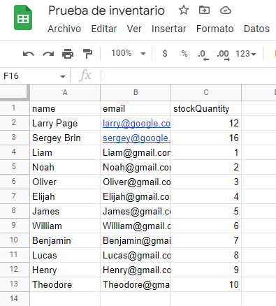

# google2Object
 
 ## Requirements
 1. Create a **Service Account**
 2. Get the service account **Credentials Json file**
 3. **Create** the spreadsheet
 4. **Get** URL of the spreadsheet
 5. **Share** the spreadsheet with the service account


# Result
### Sample Spreadsheet


```js
{
  name: [
    'Larry Page', 'Sergey Brin',
    'Liam',       'Noah',
    'Oliver',     'Elijah',
    'James',      'William',
    'Benjamin',   'Lucas',
    'Henry',      'Theodore'
  ],
  email: [
    'larry@google.com',
    'sergey@google.com',
    'Liam@gmail.com',
    'Noah@gmail.com',
    'Oliver@gmail.com',
    'Elijah@gmail.com',
    'James@gmail.com',
    'William@gmail.com',
    'Benjamin@gmail.com',
    'Lucas@gmail.com',
    'Henry@gmail.com',
    'Theodore@gmail.com'
  ],
  stockQuantity: [
    '12', '16', '1', '2',
    '3',  '4',  '5', '6',
    '7',  '8',  '9', '10'
  ]
}
```